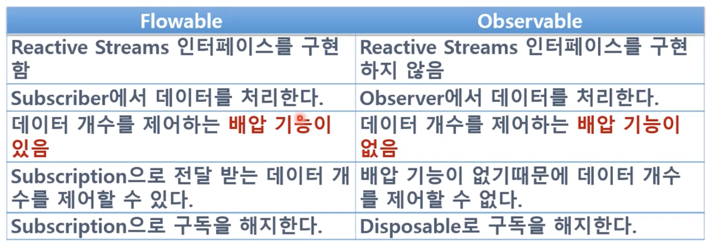
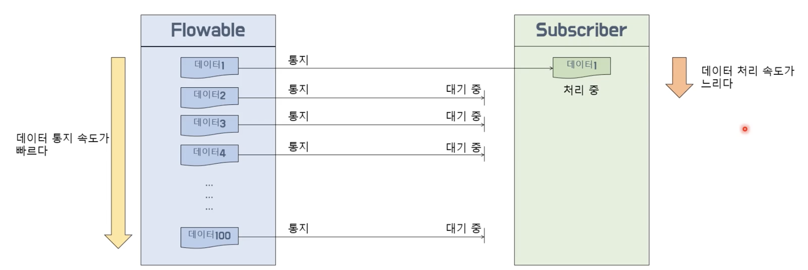

# Flowable 과 Observable

데이터 생산자란 공통점

차이점이있음.

Flowable과 Observable 비교

배압(Back Pressure) 이란?

Flowable에서 데이터를 통지하는 속도가 Subscriber에서 통지된 데이터를 전달받아 처리하는 속도 보다 빠를 때 밸런스를 맞추기 위해 데이터 통지량을 제어하는 기능을 말한다.

